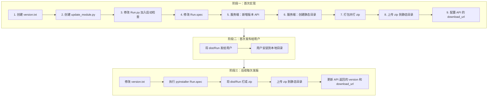
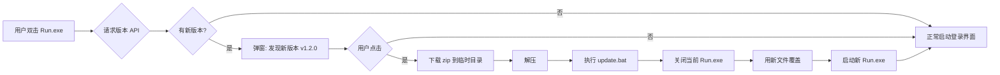
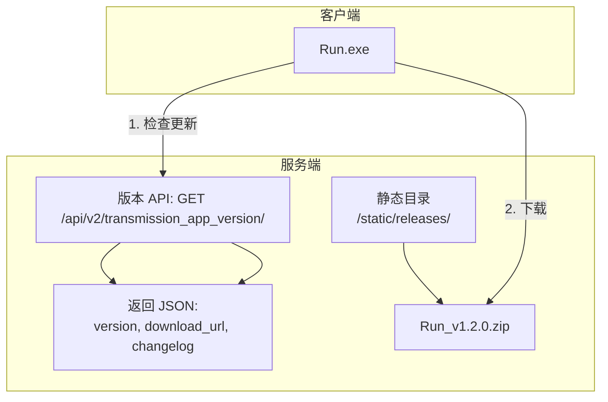

# 压裂数据传输软件 - 在线自动更新 完整实现文档

## 一、需求分析

### 1.1 现状描述

- **项目**：压裂数据传输软件（data_transmission_iteration）
- **入口**：`Run.py` → `LoginWindow` → `OpenExeWindow`
- **打包方式**：PyInstaller + `Run.spec`，输出为 `dist/Run/Run.exe`
- **数据文件**：`config.ini`、`login.ui`、`uploadMainWindow.ui`、`thread.py` 等
- **部署**：打包成 exe 后分发给现场用户使用

### 1.2 核心痛点

| 问题 | 描述 |
|------|------|
| 频繁更新 | 代码经常迭代（BUG 修复、功能优化、需求变更） |
| 分发成本高 | 每次更新需开发者重新打包 → 上传 → 通知用户 → 用户手动下载替换 |
| 版本不统一 | 用户端版本参差不齐，现场难以及时同步 |
| 运维困难 | 无法集中掌控客户端版本，排查问题效率低 |

### 1.3 目标

实现**在线/自动更新**：用户点击「检查更新」或「自动更新」即可完成升级，**无需开发者重新打包并手动分发**。

---

## 二、方案选型

### 2.1 常见实现方案对比

| 方案 | 描述 | 优点 | 缺点 | 适用场景 |
|------|------|------|------|----------|
| **方案 A：全量替换 exe** | 下载完整新 exe，关闭旧进程，替换并重启 | 实现简单、逻辑清晰 | 包大、下载慢、占用磁盘 | 小体积应用 |
| **方案 B：多文件差分更新** | 只下载变更的 .pyc/.pyd 或资源文件 | 省带宽、更新快 | 实现复杂、需版本管理 | 大体积、多模块 |
| **方案 C：Launcher + App 分离** | Launcher 负责检查更新、下载、替换、启动 App | 更新时不影响 Launcher | 需维护两个 exe | 中大型应用 |
| **方案 D：PyUpdater 等第三方库** | 使用现成库实现签名、差分、回滚 | 功能完善 | 需学习、依赖重 | 商业级应用 |

### 2.2 推荐方案：**方案 A + Launcher（简化版）**

结合本项目特点：

- 已有后端服务（`http://10.51.50.99/api/v2`）
- 使用 PyInstaller 打包为**目录模式**（`dist/Run/` 下多文件）
- 用户现场有网络

**推荐：全量 zip 包 + 内置更新逻辑 + 更新脚本来替换并重启**

- 服务端：提供版本 API + 新版本 zip 下载地址  
- 客户端：启动时检查版本 → 若有更新 → 提示用户 → 下载 zip → 解压替换 → 调用更新脚本 → 重启

本方案**无需 Launcher**，逻辑全部内置于主程序，实现成本低、易维护。

---

## 三、总体架构

### 3.1 系统架构图

```
┌─────────────────────────────────────────────────────────────────────┐
│                         服务端（更新服务器）                           │
├─────────────────────────────────────────────────────────────────────┤
│  版本 API:  GET /api/v2/transmission_app_version/                     │
│  返回: { "version": "1.2.0", "url": "xxx", "changelog": "..." }       │
│                                                                      │
│  下载资源:  zip 包 (Run_v1.2.0.zip) 或 静态文件服务器                   │
└─────────────────────────────────────────────────────────────────────┘
                                    │
                                    │ HTTP/HTTPS
                                    ▼
┌─────────────────────────────────────────────────────────────────────┐
│                         客户端（用户电脑）                             │
├─────────────────────────────────────────────────────────────────────┤
│  Run.exe (主程序)                                                     │
│    ├─ 启动时检查更新（可选：后台/启动后弹窗）                            │
│    ├─ 若需更新：下载 zip → 解压到临时目录 → 调用 update.bat             │
│    └─ update.bat: 关闭 Run.exe → 替换 dist/Run/* → 启动新 Run.exe     │
└─────────────────────────────────────────────────────────────────────┘
```

### 3.2 版本号规范

建议使用 **语义化版本**：`主版本.次版本.修订号`，如 `1.0.0`、`1.1.2`。

- 主版本：不兼容的大改动  
- 次版本：新功能、兼容改动  
- 修订号：BUG 修复、小优化  

版本号保存在：

- **客户端**：`version.txt`（与 exe 同目录）或通过 PyInstaller 写入 `version` 资源  
- **服务端**：数据库或 JSON 配置文件

---

## 四、服务端设计与实现

### 4.1 版本信息 API

在后端项目（如 fracweb）中新增接口：

**接口路径**：`GET /api/v2/transmission_app_version/`

**返回示例**：

```json
{
  "version": "1.2.0",
  "download_url": "http://10.51.50.99/static/releases/Run_v1.2.0.zip",
  "changelog": "1. 修复串口接收异常\n2. 优化上传逻辑",
  "force_update": false,
  "min_version": "1.0.0"
}
```

**字段说明**：

| 字段 | 类型 | 说明 |
|------|------|------|
| version | string | 最新版本号 |
| download_url | string | 新版本 zip 包下载地址 |
| changelog | string | 更新说明（可选） |
| force_update | bool | 是否强制更新 |
| min_version | string | 最低兼容版本（可选） |

### 4.2 静态文件部署

将打包后的 `dist/Run` 目录打成 zip（如 `Run_v1.2.0.zip`），放到 Web 静态目录，例如：

- Django：`/static/releases/Run_v1.2.0.zip`  
- Nginx：`/releases/Run_v1.2.0.zip`

确保 `download_url` 可直接通过 HTTP 下载。

### 4.3 版本配置示例（可选）

若后端暂无数据库支持，可使用 JSON 文件维护版本：

```json
// version_config.json
{
  "version": "1.2.0",
  "download_url": "http://10.51.50.99/static/releases/Run_v1.2.0.zip",
  "changelog": "1. 修复串口接收异常\n2. 优化上传逻辑",
  "force_update": false,
  "publish_time": "2025-02-22T10:00:00"
}
```

---

## 五、客户端实现

### 5.1 目录结构规划

```
data_transmission_iteration/
├── Run.py                 # 主入口
├── LoginWindow.py
├── OpenExeWindow.py
├── version.txt            # 当前版本号，如 1.0.0
├── update_module.py       # 新增：更新逻辑模块
├── update.bat             # 新增：更新脚本（或 update.ps1）
├── Run.spec
├── config.ini
└── ...
```

### 5.2 版本号管理

在项目根目录创建 `version.txt`，内容示例：

```
1.0.0
```

**重要**：打包时需将 `version.txt` 一并打包进 exe 所在目录。在 `Run.spec` 中：

```python
datas=[
    ('login.ui', '.'),
    ('uploadMainWindow.ui', '.'),
    ('config.ini', '.'),
    ('thread.py', '.'),
    ('version.txt', '.'),   # 新增
],
```

### 5.3 更新模块 `update_module.py`

```python
# coding=utf-8
"""
压裂数据传输软件 - 在线更新模块
"""
import os
import sys
import zipfile
import requests
import subprocess
from pathlib import Path

# 版本 API 地址（与 LoginWindow 中 login_url 同一服务器）
VERSION_API = "http://10.51.50.99/api/v2/transmission_app_version/"


def get_current_version():
    """读取当前版本号"""
    try:
        base_path = get_base_path()
        version_file = base_path / "version.txt"
        if version_file.exists():
            return version_file.read_text(encoding="utf-8").strip()
    except Exception as e:
        print(f"读取版本失败: {e}")
    return "0.0.0"


def get_base_path():
    """获取 exe 所在目录（兼容开发/打包两种运行方式）"""
    if getattr(sys, 'frozen', False):
        return Path(sys.executable).parent
    return Path(__file__).parent


def check_update():
    """
    检查是否有新版本
    返回: (has_update, info_dict) 或 (False, None)
    """
    try:
        resp = requests.get(VERSION_API, timeout=10)
        if resp.status_code != 200:
            return False, None
        data = resp.json()
        latest = data.get("version", "0.0.0")
        current = get_current_version()
        if _version_compare(latest, current) > 0:
            return True, data
    except Exception as e:
        print(f"检查更新失败: {e}")
    return False, None


def _version_compare(v1, v2):
    """比较版本号，v1>v2 返回 1，相等返回 0，否则 -1"""
    def parse(v):
        return [int(x) for x in v.split(".") if x.isdigit()]

    p1 = parse(v1)
    p2 = parse(v2)
    for i in range(max(len(p1), len(p2))):
        a = p1[i] if i < len(p1) else 0
        b = p2[i] if i < len(p2) else 0
        if a > b:
            return 1
        if a < b:
            return -1
    return 0


def download_and_extract(download_url, progress_callback=None):
    """
    下载 zip 并解压到临时目录
    progress_callback: (downloaded_bytes, total_bytes) -> None
    返回: 解压后的目录路径
    """
    base_path = get_base_path()
    temp_dir = base_path / "_update_temp"
    temp_dir.mkdir(exist_ok=True)
    zip_path = temp_dir / "update.zip"

    resp = requests.get(download_url, stream=True, timeout=60)
    total = int(resp.headers.get("content-length", 0))
    downloaded = 0

    with open(zip_path, "wb") as f:
        for chunk in resp.iter_content(chunk_size=8192):
            if chunk:
                f.write(chunk)
                downloaded += len(chunk)
                if progress_callback and total:
                    progress_callback(downloaded, total)

    extract_dir = temp_dir / "extracted"
    extract_dir.mkdir(exist_ok=True)
    with zipfile.ZipFile(zip_path, "r") as zf:
        zf.extractall(extract_dir)

    return extract_dir


def run_update_script(extract_dir):
    """
    调用更新脚本：关闭当前进程，替换文件，启动新 exe
    注意：此函数调用后进程会退出，由 update.bat 完成后续操作
    """
    base_path = get_base_path()
    bat_path = base_path / "update.bat"

    # 创建或使用已有的 update.bat
    bat_content = f'''@echo off
chcp 65001 >nul
echo 正在更新，请稍候...

taskkill /F /IM Run.exe 2>nul
timeout /t 2 /nobreak >nul

xcopy /E /Y /Q "{extract_dir}\\*" "{base_path}\\"
if %errorlevel% neq 0 (
    echo 更新失败
    pause
    exit /b 1
)

rd /s /q "{extract_dir}" 2>nul
del /q "{base_path}\\update.bat" 2>nul

start "" "{base_path}\\Run.exe"
exit
'''
    with open(bat_path, "w", encoding="gbk") as f:
        f.write(bat_content)

    # 启动 update.bat（会新开一个 cmd 窗口）
    subprocess.Popen(
        ["cmd", "/c", "start", "/wait", str(bat_path)],
        cwd=str(base_path),
        creationflags=subprocess.CREATE_NEW_CONSOLE,
    )
    sys.exit(0)
```

### 5.4 更新脚本 `update.bat`（运行时动态生成）

上述 `run_update_script` 会在更新时动态生成 `update.bat`，内容要点：

1. 关闭 `Run.exe`  
2. 用新文件覆盖当前目录  
3. 删除临时文件和自身  
4. 启动新的 `Run.exe`  

也可预先放一个通用模板，由 Python 填充路径后执行。

### 5.5 集成到主程序

在 `LoginWindow.py` 或 `Run.py` 中增加「检查更新」入口：

**方式一：启动时自动检查（推荐）**

在 `Run.py` 中，`app.exec_()` 之前：

```python
# Run.py 修改
import sys
from PyQt5.QtWidgets import *
from PyQt5.QtCore import QThread, pyqtSignal

from LoginWindow import LoginWindow

# 可选：在导入 LoginWindow 之前检查更新
def check_update_on_start():
    try:
        from update_module import check_update, get_current_version, download_and_extract, run_update_script
        has_update, info = check_update()
        if has_update and info:
            from PyQt5.QtWidgets import QMessageBox
            latest = info.get("version", "")
            changelog = info.get("changelog", "")
            url = info.get("download_url", "")
            if not url:
                return
            reply = QMessageBox.question(
                None, "发现新版本",
                f"发现新版本 {latest}，是否立即更新？\n\n更新内容：\n{changelog}",
                QMessageBox.Yes | QMessageBox.No,
                QMessageBox.Yes
            )
            if reply == QMessageBox.Yes:
                # 在后台线程下载，避免卡 UI
                extract_dir = download_and_extract(url)
                run_update_script(extract_dir)
    except Exception as e:
        print(f"更新检查失败: {e}")

if __name__ == '__main__':
    app = QApplication(sys.argv)
    check_update_on_start()  # 启动时检查
    form = LoginWindow()
    form.show()
    sys.exit(app.exec_())
```

**方式二：在 OpenExeWindow 菜单/状态栏增加「检查更新」按钮**

在 `OpenExeWindow` 或主窗口菜单中增加按钮，点击时执行同样的 `check_update` 逻辑，并弹出更新对话框。

### 5.6 修改 Run.spec

在 `Run.spec` 中增加：

1. `version.txt` 到 datas  
2. `update_module.py` 会自动被 PyInstaller 分析（因被 Run.py 导入）  
3. `requests` 已在 hiddenimports 中，无需额外配置  

```python
# Run.spec 中 datas 部分
datas=[
    ('login.ui', '.'),
    ('uploadMainWindow.ui', '.'),
    ('config.ini', '.'),
    ('thread.py', '.'),
    ('version.txt', '.'),   # 新增
],
```

---

## 六、打包与发布流程

### 6.1 开发者发布新版本步骤

1. **修改版本号**  
   编辑 `version.txt`，例如改为 `1.2.0`  

2. **执行打包**  
   ```bash
   pyinstaller Run.spec
   ```

3. **生成 zip 包**  
   将 `dist/Run` 整个目录压缩为 `Run_v1.2.0.zip`  

4. **上传到服务器**  
   将 `Run_v1.2.0.zip` 放到静态目录，如 `/static/releases/`  

5. **更新版本 API**  
   修改后端接口返回的 `version`、`download_url`、`changelog` 等  

### 6.2 用户端更新流程

1. 用户启动 `Run.exe`  
2. 程序请求 `GET /api/v2/transmission_app_version/`  
3. 对比 `version` 与本地 `version.txt`  
4. 若有新版本，弹窗询问是否更新  
5. 用户确认后，下载 zip → 解压 → 执行 `update.bat`  
6. `update.bat` 关闭旧进程、覆盖文件、启动新 exe  

---

## 七、安全性考虑

| 项目 | 建议 |
|------|------|
| HTTPS | 生产环境版本 API 和下载链接建议使用 HTTPS |
| 校验 | 可对 zip 包计算 MD5/SHA256，API 返回校验值，客户端校验后再解压 |
| 权限 | 确保 exe 安装目录有写权限（如不在 Program Files） |
| 回滚 | 可保留上一版本备份，更新失败时恢复 |

---

## 八、可选增强

### 8.1 静默更新

用户选择「自动更新」后，在后台下载，下载完成后再提示「请重启以完成更新」。

### 8.2 强制更新

当服务端 `force_update=True` 时，不允许跳过更新，必须更新后才能使用。

### 8.3 增量更新（进阶）

若后期 zip 包过大，可改为只下载变更文件（需服务端维护文件列表和哈希），客户端按列表替换。实现复杂度较高，可按需迭代。

---

## 九、文件清单与改动汇总

### 9.1 新增文件

| 文件 | 说明 |
|------|------|
| `version.txt` | 当前版本号 |
| `update_module.py` | 更新逻辑模块 |
| `docs/01_在线自动更新_完整实现文档.md` | 本文档 |

### 9.2 修改文件

| 文件 | 修改内容 |
|------|----------|
| `Run.spec` | datas 中增加 `version.txt` |
| `Run.py` | 启动时调用 `check_update_on_start()` |
| 后端 `urls.py` / `views.py` | 新增 `/api/v2/transmission_app_version/` 接口 |

### 9.3 依赖

- 已有：`requests`  
- 标准库：`zipfile`、`subprocess`、`pathlib`  

无需新增第三方依赖。

---

## 十、总结

通过增加**版本 API + 全量 zip 下载 + 本地替换脚本**的流程，可完成压裂数据传输软件的在线自动更新，用户只需点击确认即可完成升级，无需开发者重复打包和手动分发。  

实现时重点注意：

1. 版本号统一管理（`version.txt` + 服务端配置）  
2. exe 所在目录可写  
3. `update.bat` 的路径、编码（GBK）与 `xcopy` 用法  
4. 关闭进程与启动新进程的时机，避免文件占用  

按本文档步骤实现后，即可支持在线/实时更新。

---

## 附录 A：Django 版本 API 实现示例

若后端为 Django（如 fracweb 项目），可按以下方式添加版本接口。

### A.1 在 frac_site 中新增视图

在 `apps/frac_site/views.py` 中增加：

```python
from rest_framework.views import APIView
from rest_framework.response import Response
from rest_framework.permissions import AllowAny  # 版本检查一般无需 token

class TransmissionAppVersionView(APIView):
    """压裂数据传输软件 - 版本检查接口（无需认证）"""
    permission_classes = [AllowAny]

    def get(self, request):
        # 方式1：从配置文件/数据库读取
        # 方式2：硬编码（适合快速上线）
        data = {
            "version": "1.2.0",
            "download_url": "http://10.51.50.99/static/releases/Run_v1.2.0.zip",
            "changelog": "1. 修复串口接收异常\n2. 优化上传逻辑",
            "force_update": False,
            "min_version": "1.0.0",
        }
        return Response(data)
```

### A.2 添加路由

在 `apps/frac_site/urls.py` 中增加：

```python
path('transmission_app_version/', views.TransmissionAppVersionView.as_view()),
```

完整访问路径：`GET http://10.51.50.99/api/v2/transmission_app_version/`（或 `api/v2/frac_site/transmission_app_version/`，取决于主路由 include 方式）。

### A.3 使用 JSON 配置文件（可选）

若希望不修改代码即可更新版本信息，可增加配置文件：

```python
# views.py
import json
from django.conf import settings

def get_version_config():
    config_path = settings.BASE_DIR / 'config' / 'transmission_version.json'
    if config_path.exists():
        with open(config_path, 'r', encoding='utf-8') as f:
            return json.load(f)
    return {
        "version": "1.0.0",
        "download_url": "",
        "changelog": "",
        "force_update": False,
    }

class TransmissionAppVersionView(APIView):
    permission_classes = [AllowAny]
    def get(self, request):
        return Response(get_version_config())
```

---

## 附录 B：打包命令速查

```bash
# 进入项目目录
cd d:\YanJiuSheng\YanYi\YaLie\Transmission\data_transmission_iteration

# 使用 Run.spec 打包（目录模式）
pyinstaller Run.spec

# 输出目录
# dist/Run/Run.exe  以及依赖的 dll、pyd、config.ini、version.txt 等

# 打成 zip 供下载
# 将 dist/Run 整个文件夹压缩为 Run_v1.2.0.zip
```

---

## 附录 C：开发者实现指南（新手向）

本节面向**第一次实现在线更新**的开发者，按步骤说明需要做哪些事、是否要部署服务器、以及完整操作流程。

### C.1 总体结论：需要部署到服务器吗？

**需要。** 在线更新的前提是：客户端能通过网络访问到「版本信息」和「新版本安装包」。

| 角色 | 需要做什么 | 是否需要服务器 |
|------|------------|----------------|
| **开发者** | 1. 开发客户端更新代码<br>2. 开发/配置服务端版本 API<br>3. 打包并上传 zip 到可访问的地址 | **需要**：版本 API 和 zip 包要放在用户能访问的服务器上 |
| **用户** | 启动程序 → 弹窗点「是」→ 等待下载完成 → 自动重启 | 不需要，只需能联网 |

若项目已有后端（如 `http://10.51.50.99/api/v2`），只需在该服务器上增加版本接口和静态文件目录即可，**无需另起一台服务器**。

---

### C.2 开发者需要做的事（清单）

开发者需要完成两类工作：**客户端开发** 和 **服务端部署**。

```
┌─────────────────────────────────────────────────────────────────────────────┐
│                    开发者实现清单（按顺序执行）                                 │
├─────────────────────────────────────────────────────────────────────────────┤
│ 【一、客户端开发】在 data_transmission_iteration 项目中                          │
│   1. 新建 version.txt（当前版本号）                                             │
│   2. 新建 update_module.py（更新逻辑）                                          │
│   3. 修改 Run.py（启动时调用检查更新）                                           │
│   4. 修改 Run.spec（打包 version.txt）                                          │
│                                                                              │
│ 【二、服务端部署】在后端项目（如 fracweb）或 Web 服务器上                          │
│   5. 新增版本 API（返回 version、download_url 等）                              │
│   6. 创建静态目录，用于存放 zip 包                                               │
│   7. 首次发布：打包 → 打成 zip → 上传 → 配置 API 返回的 download_url              │
│                                                                              │
│ 【三、后续每次发版】                                                             │
│   8. 改 version.txt → 打包 → 打 zip → 上传 → 更新 API 返回                       │
└─────────────────────────────────────────────────────────────────────────────┘
```

---

### C.3 流程图总览

#### 流程图 1：整体实现流程（开发者视角）



#### 流程图 2：用户端更新流程（用户视角）



#### 流程图 3：服务端需要提供什么



---

### C.4 开发者分步操作指南

#### 第一步：创建 version.txt

1. 在项目根目录（与 `Run.py` 同级）新建文件 `version.txt`
2. 内容填写当前版本号，例如：`1.0.0`
3. 保存

---

#### 第二步：创建 update_module.py

1. 在项目根目录新建 `update_module.py`
2. 将本文档「5.3 更新模块」中的完整代码复制进去
3. 检查 `VERSION_API` 地址是否与你的服务器一致（默认 `http://10.51.50.99/api/v2/transmission_app_version/`）
4. 若服务器地址不同，修改该常量

---

#### 第三步：修改 Run.py

在 `Run.py` 中按以下方式修改：

**原代码：**
```python
if __name__ == '__main__':
    app = QApplication(sys.argv)
    form = LoginWindow()
    form.show()
    sys.exit(app.exec_())
```

**修改后：**
```python
def check_update_on_start():
    try:
        from update_module import check_update, download_and_extract, run_update_script
        has_update, info = check_update()
        if has_update and info:
            from PyQt5.QtWidgets import QMessageBox
            latest = info.get("version", "")
            changelog = info.get("changelog", "")
            url = info.get("download_url", "")
            if not url:
                return
            reply = QMessageBox.question(
                None, "发现新版本",
                f"发现新版本 {latest}，是否立即更新？\n\n更新内容：\n{changelog}",
                QMessageBox.Yes | QMessageBox.No,
                QMessageBox.Yes
            )
            if reply == QMessageBox.Yes:
                extract_dir = download_and_extract(url)
                run_update_script(extract_dir)
    except Exception as e:
        print(f"更新检查失败: {e}")

if __name__ == '__main__':
    app = QApplication(sys.argv)
    check_update_on_start()   # 新增：启动时检查更新
    form = LoginWindow()
    form.show()
    sys.exit(app.exec_())
```

---

#### 第四步：修改 Run.spec

打开 `Run.spec`，找到 `datas=` 那一行，在列表末尾增加 `('version.txt', '.')`：

```python
datas=[
    ('login.ui', '.'),
    ('uploadMainWindow.ui', '.'),
    ('config.ini', '.'),
    ('thread.py', '.'),
    ('version.txt', '.'),   # 新增这一行
],
```

---

#### 第五步：服务端新增版本 API

**若使用 Django（fracweb 项目）：**

1. 打开 `apps/frac_site/views.py`，添加视图类（见附录 A.1）
2. 打开 `apps/frac_site/urls.py`，添加路由：
   ```python
   path('transmission_app_version/', views.TransmissionAppVersionView.as_view()),
   ```
3. 确认主路由中 frac_site 的 include 路径，得到完整 URL，例如：
   - `http://10.51.50.99/api/v2/transmission_app_version/` 或
   - `http://10.51.50.99/api/v2/frac_site/transmission_app_version/`

**若使用其他框架：** 只要提供一个 GET 接口，返回 JSON 格式的 `version`、`download_url`、`changelog` 即可。

---

#### 第六步：创建静态目录并配置

1. 在服务器上创建目录，用于存放 zip 包，例如：
   - Django：`项目根/static/releases/`
   - Nginx：`/var/www/html/releases/`
2. 确保该目录可通过 HTTP 访问，例如：
   - `http://10.51.50.99/static/releases/Run_v1.0.0.zip` 能直接下载

---

#### 第七步：首次打包与发布

1. 在项目目录执行：`pyinstaller Run.spec`
2. 打包完成后，进入 `dist/Run` 目录
3. 将 `dist/Run` **整个文件夹**压缩为 `Run_v1.0.0.zip`（版本号与 version.txt 一致）
4. 将 `Run_v1.0.0.zip` 上传到步骤六创建的静态目录
5. 在版本 API 的返回中配置：
   - `version`: `"1.0.0"`
   - `download_url`: `"http://10.51.50.99/static/releases/Run_v1.0.0.zip"`
   - `changelog`: 更新说明

6. 将 `dist/Run` 整个文件夹（或 `Run_v1.0.0.zip` 解压后的内容）分发给用户安装

---

#### 第八步：后续每次发版

当代码有更新需要发布时：

| 序号 | 操作 | 说明 |
|------|------|------|
| 1 | 修改 `version.txt` | 如改为 `1.1.0` |
| 2 | 执行 `pyinstaller Run.spec` | 重新打包 |
| 3 | 将 `dist/Run` 打成 `Run_v1.1.0.zip` | 版本号与 version.txt 一致 |
| 4 | 上传 `Run_v1.1.0.zip` 到静态目录 | 覆盖或新增文件 |
| 5 | 修改版本 API 的返回 | 更新 `version`、`download_url`、`changelog` |

用户下次启动程序时，会自动检测到新版本并弹窗，用户点「是」即可完成更新。

---

### C.5 常见问题（新手必读）

| 问题 | 解答 |
|------|------|
| 没有独立服务器怎么办？ | 使用现有后端服务器（如 10.51.50.99）即可，版本 API 和 zip 都放在同一台机器 |
| 用户安装目录需要特殊要求吗？ | 需要**有写权限**。不要装在 `C:\Program Files` 等受保护目录，可装在 `D:\Run` 或用户桌面下的文件夹 |
| zip 包应该包含什么？ | 与 `dist/Run` 内容一致，即 Run.exe 及其同目录下的所有文件（dll、pyd、config.ini、version.txt 等） |
| 用户点「否」会怎样？ | 程序正常启动，不更新，下次启动仍会再次检测 |
| 更新失败怎么办？ | 检查：① 网络是否通畅 ② download_url 是否能在浏览器中直接下载 ③ 安装目录是否有写权限 |
| 能否不弹窗、静默更新？ | 可以，修改 `check_update_on_start` 逻辑：用户选择「自动更新」后，后台下载，下载完成再提示重启 |

---

### C.6 检查清单（实现前后自检）

实现完成后，可按以下清单自检：

**客户端：**
- [ ] `version.txt` 已创建且已加入 Run.spec 的 datas
- [ ] `update_module.py` 已创建，VERSION_API 地址正确
- [ ] `Run.py` 中已调用 `check_update_on_start()`
- [ ] 本地运行 `python Run.py` 能正常启动（开发环境可能因无网络而跳过更新）

**服务端：**
- [ ] 版本 API 已部署，浏览器访问返回正确 JSON
- [ ] 静态目录已创建，zip 包可通过 download_url 直接下载
- [ ] API 中的 `version` 大于客户端 `version.txt` 时，才会触发更新

**首次发布：**
- [ ] 已打包并生成 zip，zip 内包含 Run.exe 及全部依赖
- [ ] zip 已上传，API 的 download_url 指向该 zip
- [ ] 将 dist/Run 或 zip 解压后的内容发给用户完成首次安装

---

### C.7 小结

实现「用户启动 → 自动检查更新 → 弹窗 → 点「是」→ 下载替换 → 自动重启」的流程，开发者需要：

1. **开发**：新增 `version.txt`、`update_module.py`，修改 `Run.py` 和 `Run.spec`
2. **部署**：在现有服务器上增加版本 API 和静态目录
3. **发布**：打包 → 打 zip → 上传 → 配置 API

**需要服务器**：是，版本 API 和 zip 包必须放在用户能访问的 Web 服务器上。若已有后端（如 10.51.50.99），只需在该服务器上扩展接口和静态资源即可。
