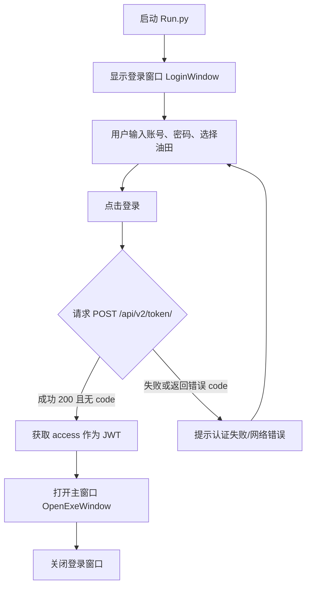
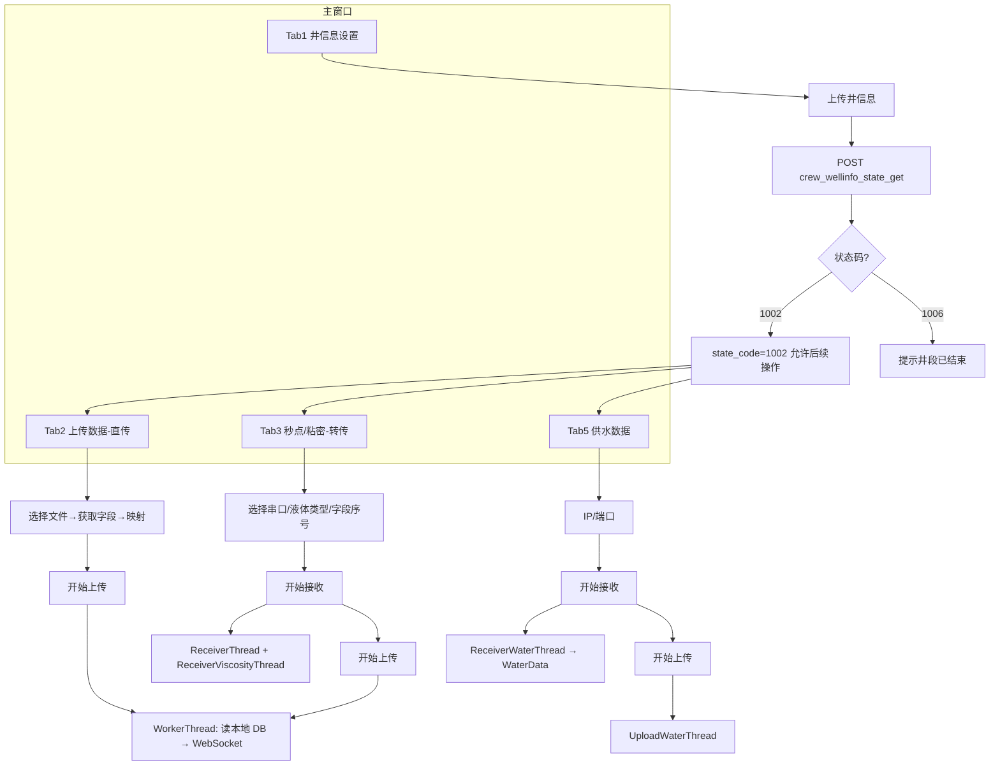
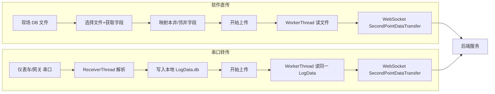
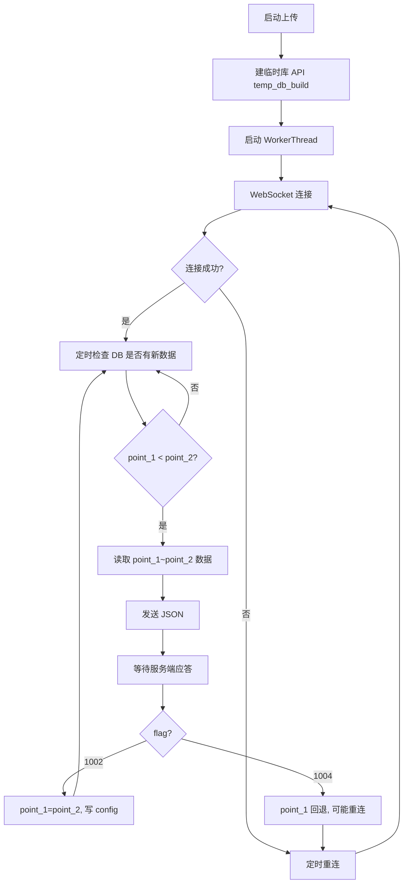
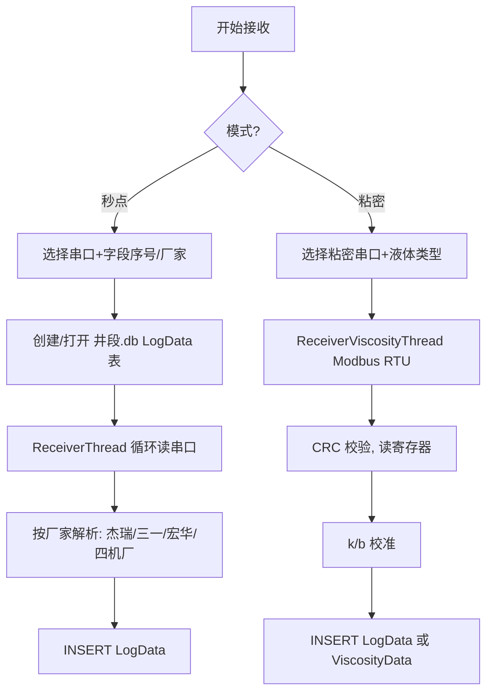

# 压裂数据传输软件 - 代码说明与业务逻辑文档

本文档面向新手，详细说明 `data_transmission_iteration` 项目的作用、各模块职责及完整业务逻辑，并配有流程图便于理解。

---

## 一、项目概述

### 1.1 项目是什么

本系统是一套 **压裂施工现场数据传输客户端**，用于在油气田压裂作业现场：

- **采集** 仪表车/网关设备产生的施工数据（压力、排量、砂比、粘度、密度、供水等）
- **上传** 到远程服务器，供指挥中心或数据中心实时查看与存档

适用场景：中石油煤层气等油田的压裂施工数据实时采集与上报。

### 1.2 技术栈

| 类型     | 技术/库                |
|----------|------------------------|
| 界面     | PyQt5（.ui 转 Python） |
| 通信     | HTTP/HTTPS、WebSocket、串口(Serial)、Modbus TCP |
| 本地存储 | SQLite、配置文件 config.ini |
| 打包     | PyInstaller（Run.spec） |

### 1.3 目录与核心文件

```
data_transmission_iteration/
├── Run.py                 # 程序入口，启动登录窗口
├── LoginWindow.py         # 登录窗口：账号/密码/油田，获取 JWT
├── OpenExeWindow.py       # 主窗口：井信息、直传/转传、秒点/粘密/供水
├── thread.py              # 所有工作线程：接收串口、上传 WebSocket
├── login.py               # 登录界面 UI（由 login.ui 生成）
├── uploadMainWindow.py    # 主窗口 UI（由 uploadMainWindow.ui 生成）
├── login.ui / uploadMainWindow.ui  # Qt 设计师界面
├── config.ini             # 指针、井信息、仪表车字段、液体校准等配置
├── Run.spec               # PyInstaller 打包配置
└── docs/                  # 文档目录
```

---

## 二、各文件作用说明

### 2.1 Run.py

- **作用**：程序入口。
- **逻辑**：创建 Qt 应用 → 显示 `LoginWindow` → 进入事件循环。
- **注意**：若后续增加“启动时检查更新”，会在此处先执行检查再显示登录窗口。

### 2.2 LoginWindow.py

- **作用**：用户登录与鉴权，获取后续接口所需的 JWT。
- **主要逻辑**：
  - 界面：账号、密码、油田（如“中石油煤层气公司”）下拉框，登录按钮。
  - 登录时可选获取本机 CPU 序列号、MAC（代码中有采集，未强制参与认证）。
  - 请求 `POST /api/v2/token/`，提交 `username、password、company`。
  - 成功：从响应中取 `access` 作为 JWT，打开 `OpenExeWindow(jwt_token)` 并关闭登录窗。
  - 失败：根据状态码或异常弹出“认证失败”“网络错误”等提示。
- **重要变量**：`self.jwt_token` 传入主窗口，后续所有带鉴权的 HTTP/WebSocket 均使用该 Token。

### 2.3 OpenExeWindow.py

- **作用**：主业务界面，包含井信息设置、三种数据的接收与上传（秒点、粘密、供水），以及直传/转传两种模式。
- **界面结构**：
  - **Tab1 - 井信息设置**：区块、井台、井号、压裂次数、层位、段/级编号、压裂队、仪表车厂家、传输方式（软件直传 / 串口转传）、设备号、**上传井信息** 按钮。
  - **Tab2 - 上传数据**：仅在“软件直传”时显示。选择源文件（.mdb/.db/.xlsx 等）→ 获取字段 → 将现场库表头映射到系统标准字段（本井/邻井）→ 开始上传/结束。
  - **Tab3 - 施工秒点数据、液体性能数据**：仅在“串口转传”时显示。选择串口（秒点）、粘密串口、液体类型 → 配置字段序号（1–18）→ 开始/停止接收 → 开始/停止上传。
  - **Tab5 - 供水数据**：IP、端口（Modbus TCP）→ 开始/停止接收 → 开始/停止上传。
- **与后端的交互**（通过 `base_API`）：
  - `GET /basic_info_get`：获取区块、井台、压裂队、仪表车、设备、字段标签等下拉选项。
  - `POST /get_well`：根据区块获取井号列表。
  - `POST /get_layers`：根据井号获取层位、压裂次数。
  - `POST /get_period`：根据井号、压裂次数获取段/级编号。
  - `POST /crew_wellinfo_state_get`：上传井信息，获取/更新井段状态码（如 1002 可施工）。
  - `POST /temp_db_build`：建临时秒点库（直传或转传后上传前都会调）。
  - `POST /temp_db_build_two`：粘密临时库（若单独建表则用此接口）。
  - `POST /temp_db_build_water`：供水临时库。
  - `POST /update_state_code`：施工结束时更新状态码为 1006。
- **配置**：`load_config` / `save_config` 读写 `config.ini`（指针、井信息、仪表车字段映射等），保证重启后能续传、恢复界面选项。

### 2.4 thread.py

集中了所有 **工作线程**，避免阻塞主界面：

| 类名                   | 作用简述 |
|------------------------|----------|
| **WorkerThread**       | 秒点数据上传。连接 WebSocket `SecondPointDataTransfer`，按 `point_1/point_2` 从本地 SQLite `LogData` 读增量，合并粘密行后以 JSON 发送；收到 1002 前移指针，1004 回退并可能触发重连。 |
| **ReceiverThread**     | 秒点数据接收。根据仪表车厂家（杰瑞/三一/宏华/四机厂）解析串口数据，写入 `C:/a_transmission_data/{井号}/{井段}.db` 的 `LogData` 表。 |
| **ReceiverViscosityThread** | 粘/密度接收。Modbus RTU 串口读寄存器，CRC 校验，按液体类型做 k/b 校准后写入同一 DB 的 `LogData`（viscosity/density/system_time）或单独表。 |
| **UploadViscosityThread**   | 粘/密度上传。WebSocket `ViscosityDataTransfer`，从本地粘密表按指针增量上传。 |
| **ReceiverWaterThread**     | 供水数据接收。Modbus TCP 连接指定 IP:端口，解析瞬时流量、累积液量，写入 `WaterData` 表。 |
| **UploadWaterThread**       | 供水数据上传。WebSocket `WaterDataTransfer`，按指针从 `WaterData` 增量上传。 |

所有上传线程都带 **重连**：断线或错误时定时重连 WebSocket，并将连接状态通过信号反馈到主窗口状态栏。

### 2.5 config.ini

- **Parameters**：`point_1`、`point_2`，秒点上传进度指针。
- **viscosity_pointer / water_pointer**：粘密、供水上传进度指针。
- **basic_information_settings**：上次选择的区块、井台、井号、压裂次数、层位、段、压裂队等。
- **measuring_truck_field_settings**：不同仪表车（宏华/杰瑞/三一/四机厂）的字段名或序号映射，用于“获取字段”和串口解析。
- **calibration_parameter**：不同液体类型（滑溜水、胍胶等）的粘度校准系数 k、b。
- **liquid_list**：液体类型列表，供界面下拉选择。

---

## 三、业务逻辑详解

### 3.1 状态码含义（井段施工状态）

后端用状态码表示当前井段是否允许接收/上传数据：

| 状态码 | 含义           | 前端常见处理 |
|--------|----------------|--------------|
| 1001   | 初始/待开工     | -            |
| 1002   | 可正常接收数据 | 允许上传井信息、建临时库、开始上传 |
| 1003   | 服务端已收到数据 | 指针前移等   |
| 1004   | 网络异常/断线   | 指针不前移、重连 |
| 1006   | 施工已结束     | 禁止再传，提示“该井段已结束” |

只有在上传井信息后拿到 **1002**，Tab2/Tab3/Tab5 才允许进行数据上传操作；否则点击会提示“请先上传井信息！”。

### 3.2 整体业务流程（从登录到上传结束）

1. **登录**  
   用户输入账号、密码、选择油田 → 请求 `/api/v2/token/` → 获得 JWT → 进入主窗口。

2. **初始化主窗口**  
   - 调用 `basic_info_get` 拉取区块、井台、压裂队、仪表车、设备、字段标签等，填充下拉框。  
   - 从 `config.ini` 恢复上次的井信息、指针、仪表车字段映射。

3. **上传井信息（必做）**  
   用户选择：区块 → 井台 → 井号 → 压裂次数 → 层位 → 段/级编号 → 压裂队 → 仪表车厂家，点击“上传井信息，准备开始施工”。  
   - 请求 `crew_wellinfo_state_get`，后端返回状态码（如 1002 表示可施工）。  
   - 若为 1002，保存到 `state_code` 并写入 config，之后“上传数据”“秒点/粘密/供水”等 Tab 才可用。  
   - 若为 1006，提示该井段已结束。

4. **数据来源两种模式**

   - **软件直传**（Tab2）  
     - 选择现场仪表车数据库文件（.mdb/.db/.xlsx，支持杰瑞/三一/中油科昊等）。  
     - “获取字段”后，将现场表头映射到系统标准字段（至少套管压力、套管排量、砂比必选）。  
     - “开始上传”：先请求 `temp_db_build` 在后端建临时库，再启动 **WorkerThread**，从本地文件按 `point_1/point_2` 读取 LogData 增量，通过 WebSocket 发送；指针与状态由服务端应答（1002/1004）更新并写回 config。

   - **串口转传**（Tab3）  
     - 选择“秒点”串口、粘密串口、液体类型，配置各标准字段对应的序号（1–18）。  
     - “开始接收”：创建本地 `C:/a_transmission_data/{井号}/{井段}.db`，**ReceiverThread** 收串口写入 `LogData`，**ReceiverViscosityThread** 写粘密到同库（或粘密表）。  
     - “开始上传”：同样先 `temp_db_build`（若需），再启动 **WorkerThread**（和直传共用），从本地该 db 的 LogData 按指针上传；粘密单独用 **UploadViscosityThread** 上传。

5. **供水数据（Tab5）**  
   - 填写 IP、端口（Modbus TCP）→ “开始接收”：**ReceiverWaterThread** 建 `WaterData` 表并持续读 Modbus 写入。  
   - “开始上传”：请求 `temp_db_build_water` 后，**UploadWaterThread** 按指针上传供水数据。

6. **结束施工**  
   用户点击“结束”：停止上传线程，请求 `update_state_code` 将井段状态置为 1006，后端可将临时库转存为正式库；必要时清空本地指针并写回 config。

### 3.3 秒点数据流（直传 vs 转传）

- **直传**：  
  现场库文件（杰瑞/三一/中油科昊）→ 用户选择文件并映射字段 → 程序按指针读取 → WebSocket 发送到 `SecondPointDataTransfer`。

- **转传**：  
  仪表车/网关通过串口发数据 → **ReceiverThread** 按厂家协议解析 → 写入本地 `LogData` → **WorkerThread** 再从该 db 按指针通过 WebSocket 上传（与直传同一通道）。

粘密数据在转传模式下可写入同一 `LogData` 表（viscosity/density 列），上传前 **WorkerThread** 会做“按 system_time 合并粘密到秒点行”的处理，保证一条记录同时包含压力排量与粘密。

### 3.4 仪表车厂家与协议

- **杰瑞**：逗号分隔字段，顺序与“获取字段”后选择的列一致；支持从 .db 的 LogData 读表头。  
- **三一重工**：可发送约 20 个数据，客户端按配置的序号（1–18）选取对应列写入 LogData。  
- **宏华 / 四机厂**：逗号或空格分隔，格式在 `ReceiverThread.run()` 中按厂家分支解析并写入 LogData。

粘密设备通过 **Modbus RTU**（串口）读寄存器，**ReceiverViscosityThread** 中写死功能码、地址、寄存器数量，解析粘度/密度并经 k/b 校准后落库。  
供水设备通过 **Modbus TCP**（IP+端口），**ReceiverWaterThread** 发请求帧，解析响应中的浮点（瞬时流量、累积液量）写入 WaterData。

---

## 四、业务逻辑流程图

### 4.1 程序启动与登录流程



### 4.2 主窗口业务总览（从井信息到三种数据）



### 4.3 秒点数据：直传 vs 转传



### 4.4 上传线程与指针、重连



### 4.5 串口接收与落库（秒点 + 粘密）



---

## 五、关键概念小结（便于新手记忆）

| 概念 | 说明 |
|------|------|
| **JWT** | 登录后拿到的 Token，所有请求头里带 `Authorization: Bearer <token>`，WebSocket 通过子协议带 token。 |
| **井信息** | 区块、井台、井号、压裂次数、层位、段号、压裂队、仪表车厂家等，上传后后端返回状态码，只有 1002 才能传数据。 |
| **直传** | 直接用现场已有数据库文件，映射字段后由程序读库上传。 |
| **转传** | 现场设备通过串口发数据，程序先收到本地 db，再按同样逻辑从本地 db 上传。 |
| **point_1 / point_2** | 上传进度指针，表示已上传到哪一条；存 config，断线或重启后可从断点续传。 |
| **临时库** | 后端为当前井段建的库，前端通过 temp_db_build 等接口通知后端建表结构，再通过 WebSocket 推送数据。 |
| **状态码 1006** | 施工结束，前端调用 update_state_code，后端可把临时库转存为正式库。 |

---

## 六、阅读与调试建议

1. **先跑通流程**：按“登录 → 上传井信息 → 选直传或转传 → 接收/上传”走一遍，结合状态栏和 config.ini 观察指针与状态。  
2. **看信号与槽**：`thread.py` 里 `pyqtSignal` 与主窗口的 `connect`，理解“线程完成/出错/进度”如何更新界面。  
3. **对照后端**：文档中 API 路径、状态码、WebSocket 路由需与后端（如 fracweb）一致，便于联调。  
4. **配置与路径**：本地 db 路径写死为 `C:/a_transmission_data/`，若部署环境不同需统一修改。

---

## 七、流程图文件说明

- **本文档内**：第四节已包含多张 Mermaid 流程图（程序启动与登录、主窗口总览、直传/转传、上传线程与指针、串口接收与落库），在支持 Mermaid 的编辑器（如 VS Code+插件、Typora）中可直接渲染。
- **独立流程图文件**：`docs/业务逻辑流程图.md` 中集中放置了 6 张 Mermaid 图，便于复制到 [Mermaid Live Editor](https://mermaid.live/) 导出为 PNG/SVG，或嵌入到其它文档。
- 若需一张总览图，可将「图1：程序整体流程」在 Mermaid 编辑器中打开并导出为图片后，放在 `docs/` 目录使用。

---

## 八、新需求分析：采集后本地秒点画图（不上传即可出图）

以下从高级开发工程师视角，结合现有架构与生产环境复杂性，对「在 .exe 中采集到数据后，不依赖上传服务器即可画出秒点数据图」进行详细分析，并给出实现思路与落地建议。

---

### 8.1 需求理解与现状对比

| 维度 | 现状 | 新需求 |
|------|------|--------|
| 数据流 | 客户端采集 → 上传服务器 → 后端写 .db → PlotConsumers 轮询 .db → Web 前端画图 | 客户端采集 → **本地直接读同一份数据** → **在 .exe 内画秒点曲线**，可选是否上传 |
| 使用场景 | 现场必须联网，指挥中心/大屏依赖服务器与 Web 前端 | 现场可**脱机**或**弱网**时，仅靠本机即可看到实时曲线；或作为上传前的本地预览 |
| 数据源 | 服务器上井段 .db 的 second_data 表 | 客户端本机已有：串口转传时的 `C:/a_transmission_data/{井号}/{井段}.db` 的 **LogData**，或直传时用户选择的源文件（.mdb/.db） |

结论：**数据在客户端本地已经存在**（接收线程写 LogData，或直传时打开的文件），新需求本质是「在现有采集与存储之上，增加本地读取并绘图的能力」，不改变上传链路，属于**增量功能**。

---

### 8.2 技术可行性

- **数据来源**：与 `WorkerThread` 相同——串口转传时用 `self.file_path` 指向的 SQLite（LogData）；直传时用用户选择的文件。绘图模块只需对该 db 做 **SELECT**（按 ID 或 Time 区间），与接收线程的 **INSERT**、上传线程的 **SELECT** 可并发，SQLite 支持多读单写。
- **绘图库选型**（在 PyQt5 桌面环境下）：
  - **Qt Charts（PyQt5 内置）**：无需额外依赖，打包体积小，适合折线图；大量点（如数万）时需注意只追加或按窗口采样，避免一次性加载过多导致卡顿。
  - **pyqtgraph**：适合实时流式更新、数据量大，需增加依赖与打包配置。
  - **matplotlib + FigureCanvasQTAgg**：生态熟、可定制性强，大数据量时需配合 blit 或降采样。
- **推荐**：优先 **Qt Charts**，与现有 PyQt5 一致、无新 pip 依赖、打包简单；若后续需要更复杂的实时缩放/多 Y 轴，再考虑 pyqtgraph。

---

### 8.3 实现思路（概要）

1. **界面**：在主窗口中新增一个「本地秒点曲线」Tab（或独立子窗口），与「井信息」「上传数据」「秒点/粘密」「供水」并列；仅在已选择/已生成当前井段 db（即 `self.file_path` 有效）时可用。
2. **数据读取**：  
   - 从当前 `self.file_path` 对应的 SQLite 中读 **LogData**（与 thread.py 中 WorkerThread 使用的表一致）。  
   - 使用与后端一致的字段名：**Time、套管压力、套管排量、砂比、累积液量、累积砂量、viscosity、density** 等（若表结构为「本井/邻井」混合，只取本井相关列）。  
   - 首次加载或定时刷新：`SELECT * FROM LogData ORDER BY ID ASC`，或按 `ID > last_displayed_id` 增量拉取，减少重复查询。
3. **刷新策略**：  
   - **串口转传**：接收线程每写入一批数据，通过 **pyqtSignal** 通知主界面「有新数据」；绘图模块定时（如 1 s）或收到信号后从 db 增量读取并追加到曲线。  
   - **软件直传**：上传过程中 db 可能由外部进程写入，可采用定时轮询（如 2 s）或「刷新」按钮触发一次全量/增量读取。  
   - 避免在接收/上传线程内直接操作 UI 或绘图，仅发信号；所有读 db、更新图表的逻辑在主线程或单独的「绘图刷新」定时器中执行，保证线程安全。
4. **曲线内容**：至少与后端推送给前端的保持一致：**时间轴（Time）** 为 X 轴；Y 轴多条曲线：**套管压力、套管排量、砂比**（必选），以及 **累积液量、累积砂量、粘度、密度** 等（可选或可配置勾选）。单位、量纲与现有 Web 端一致，便于现场与指挥中心对照。
5. **与上传的关系**：  
   - 「是否上传」与「是否画本地图」解耦：**无论是否点击上传，只要本地有 LogData 数据源，就可以画本地图**。  
   - 上传开启时，本地图与服务器端 Web 曲线可同时存在（数据同源不同端）；上传关闭时，仅本地图可用，满足「不上传也能出图」的需求。

---

### 8.4 生产环境与复杂情况考虑

| 问题 | 分析 | 建议 |
|------|------|------|
| **读写并发** | 接收线程持续 INSERT，绘图处 SELECT；SQLite 多读一写安全，但长时间写可能导致短暂锁等待 | 绘图查询使用短事务、按 ID 范围分批读；若遇 `database is locked`，重试或跳过本帧，下一周期再读 |
| **数据量** | 单段施工可能数小时，秒点约 1 条/秒，数万条常见；一次性全量画可能卡顿 | 绘图只展示「当前窗口」或「最近 N 条」；或后端采用「时间轴+固定缓冲」思路，前端只绘制可见区间；超长段可做前端降采样（如每 5 秒取一点）再绘制 |
| **直传时文件被占用** | 直传选中的 .mdb/.db 可能被其他进程独占（如仪表车软件） | 直传场景下若无法打开，本地图 Tab 置灰并提示「当前数据源被占用，仅支持上传模式」；或约定直传时复制一份到临时 db 再绘图 |
| **多井段切换** | 用户切换井段或重新选择文件后，数据源变化 | 切换时清空当前曲线，重新从新 `file_path` 加载；若新路径暂无数据，提示「暂无数据」 |
| **打包与依赖** | 新增绘图库可能引入额外 dll/so | 优先 Qt Charts（PyQt5 已带），打包时确认 Qt5Charts 或对应模块已包含；若用 pyqtgraph/matplotlib，需在 Run.spec 的 hiddenimports 与 datas 中显式加入 |
| **性能与 UI 卡顿** | 主线程中频繁读 db、重绘图表会阻塞界面 | 读 db 与构造曲线数据可在 QTimer 或工作线程中执行，结果通过信号传回主线程只做「更新图表」；图表控件仅在主线程更新 |
| **与现有状态码的配合** | 当前「上传井信息→1002」控制 Tab 可用性 | 本地图可单独控制：有 `file_path` 且 db 内存在 LogData 表即可用，不必强依赖 1002；或与「串口转传」Tab 一致，仅在 state_code==1002 时开放，由产品决定 |

---

### 8.5 实现步骤建议（分阶段）

1. **阶段一（最小可用）**  
   - 新增「本地秒点曲线」Tab，放置一个 Qt Charts 的 QChartView（或 pyqtgraph 的 PlotWidget）。  
   - 从 `self.file_path` 的 LogData 表读 Time、套管压力、套管排量、砂比，绘制 3 条折线；无数据时提示「请先开始接收或选择文件」。  
   - 提供「刷新」按钮，点击后重新执行 SELECT 并重绘；串口转传时可由 ReceiverThread 在每次写入后发信号，触发刷新。  
   - 不改变现有上传、接收、配置逻辑。

2. **阶段二（实时与体验）**  
   - 定时器（如 1 s）或信号驱动增量查询（`ID > last_id`），追加新点到曲线，避免整表重查。  
   - 增加累积液量、累积砂量、粘度、密度等可选曲线；可选「显示/隐藏」某条线。  
   - 与后端一致：时间轴为 X 轴，支持随数据延伸（仅显示最近一段时间或全量，视性能而定）。

3. **阶段三（健壮与运维）**  
   - 读 db 异常（如文件被删、被锁）时友好提示，不崩溃。  
   - 打包后在实际现场环境验证：长时间运行、大数据量、直传/转传切换下的表现。  
   - 必要时增加「导出当前曲线数据」或截图，便于现场留存。

---

### 8.6 数据流对比（小结）

- **原流程**：采集 → 本地 LogData（可选）→ 上传 → 服务器 second_data → PlotConsumers → Web 前端画图。  
- **新能力**：采集 → 本地 LogData → **本地绘图模块读 LogData → .exe 内秒点曲线**；上传分支保持不变。  

这样，**在不依赖服务器、不上传的前提下，现场即可看到与后端一致的秒点曲线**；若同时开启上传，则本地与服务器端可并行展示，互不影响。

---

*文档版本：1.1 | 第八章为「本地秒点画图」需求分析，适用于 data_transmission_iteration 项目*
