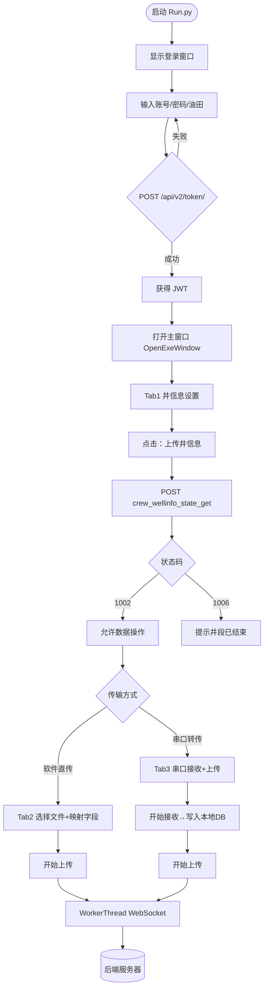
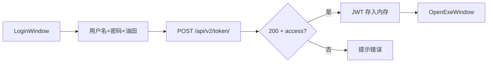
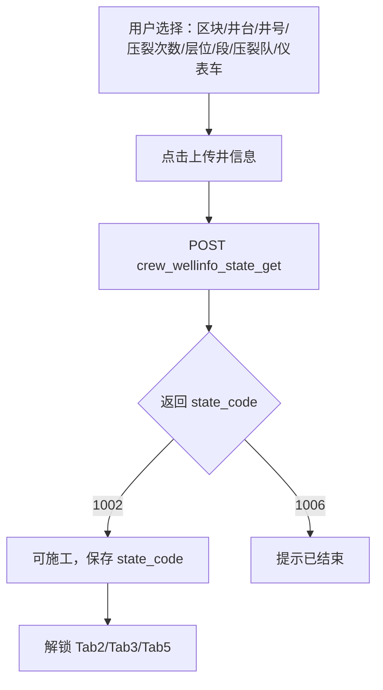
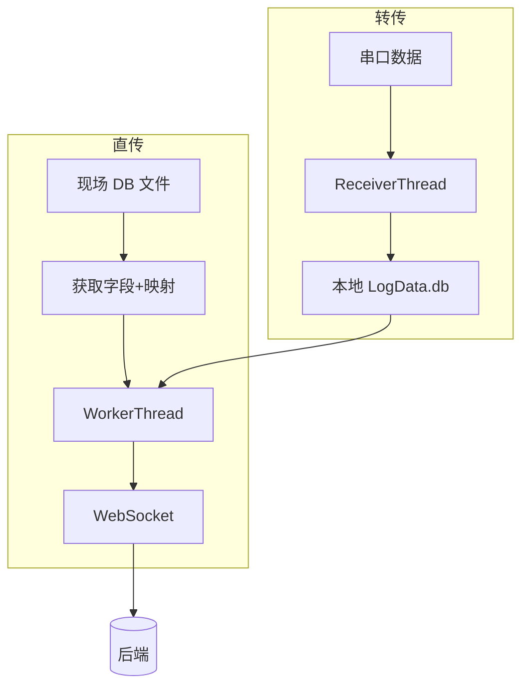
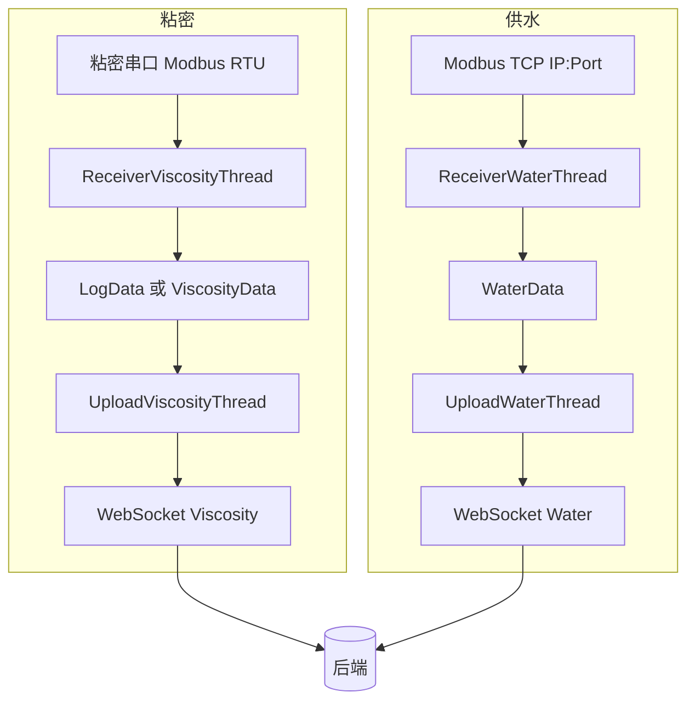
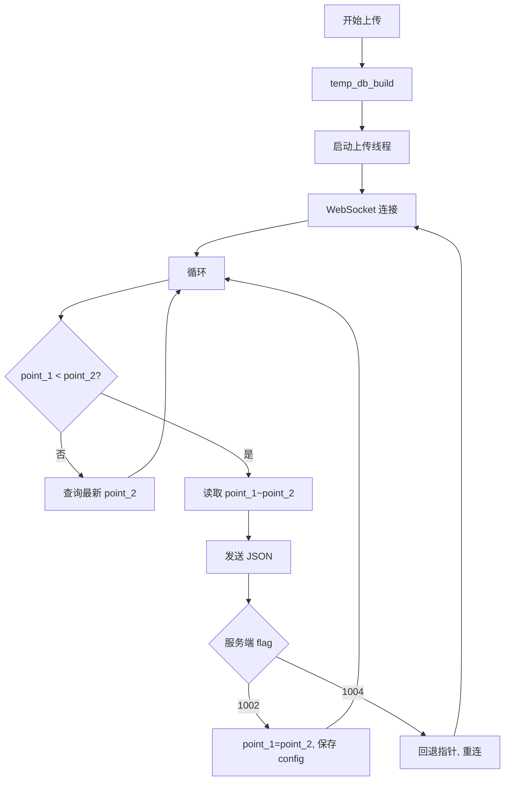

# 业务逻辑流程图（Mermaid）

以下流程图可用 VS Code 的 Mermaid 插件、Typora 或 [Mermaid 在线编辑器](https://mermaid.live/) 预览；导出为 PNG/SVG 后可插入到文档或汇报中。

---

## 图1：程序整体流程（从启动到上传）

---

## 图2：登录与鉴权

---

## 图3：井信息与状态码

---

## 图4：秒点数据流（直传 + 转传）

---

## 图5：粘密与供水数据流

---

## 图6：上传线程与断点续传

---

*将上述代码块复制到 Mermaid 编辑器中即可渲染或导出为图片。*
